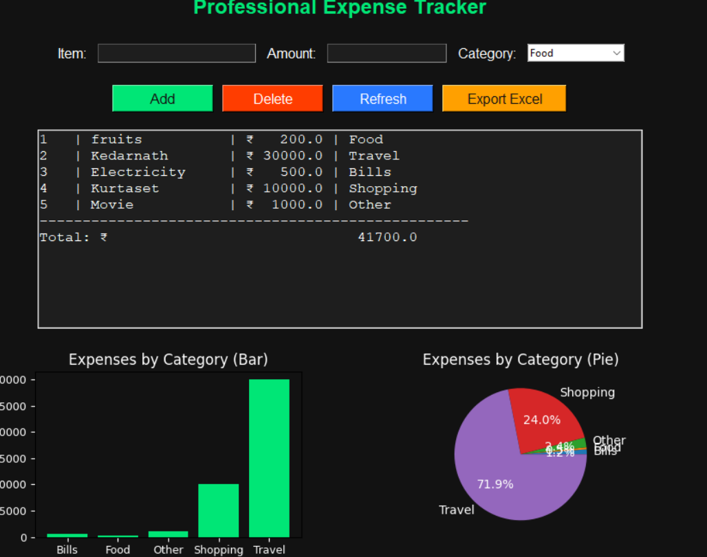
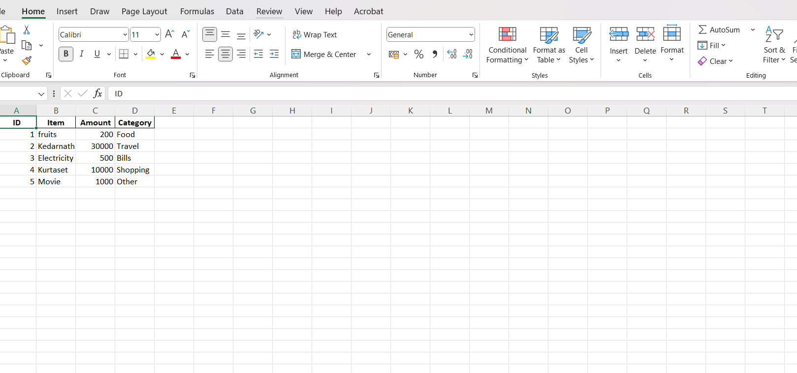

# Expense Tracker

Simple desktop app built with Python & Tkinter to track personal expenses, categorize them, visualize spending, and export to Excel.

## Features
- Add / edit / delete expenses
- Categorize expenses
- Export to Excel
- Visual summary charts

## Screenshots




## Quick Start
```bash
git clone https://github.com/Mounika24-20/Expense_Tracker.git
cd Expense_Tracker
python -m venv venv
# activate venv
pip install -r requirements.txt
python main.py
